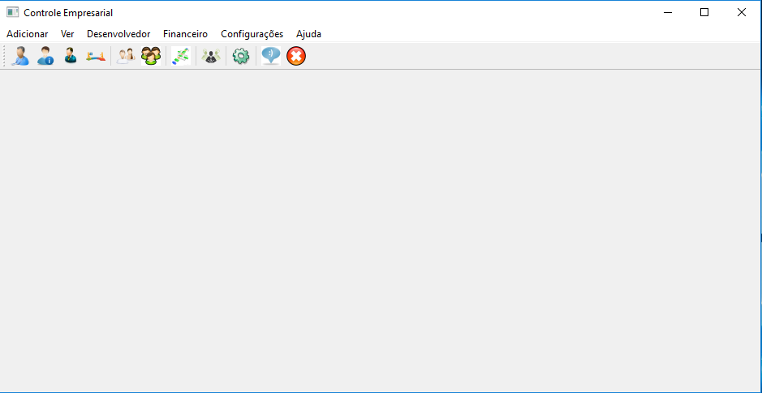
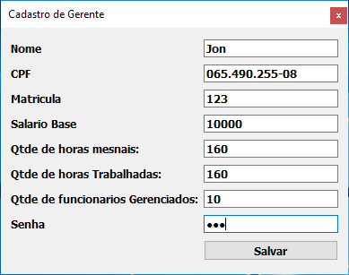
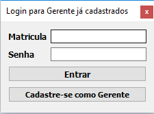
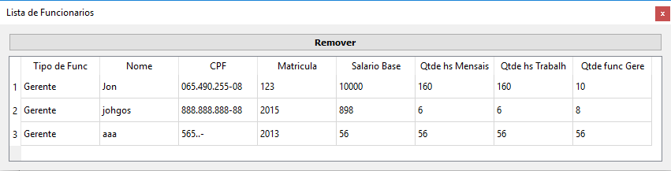
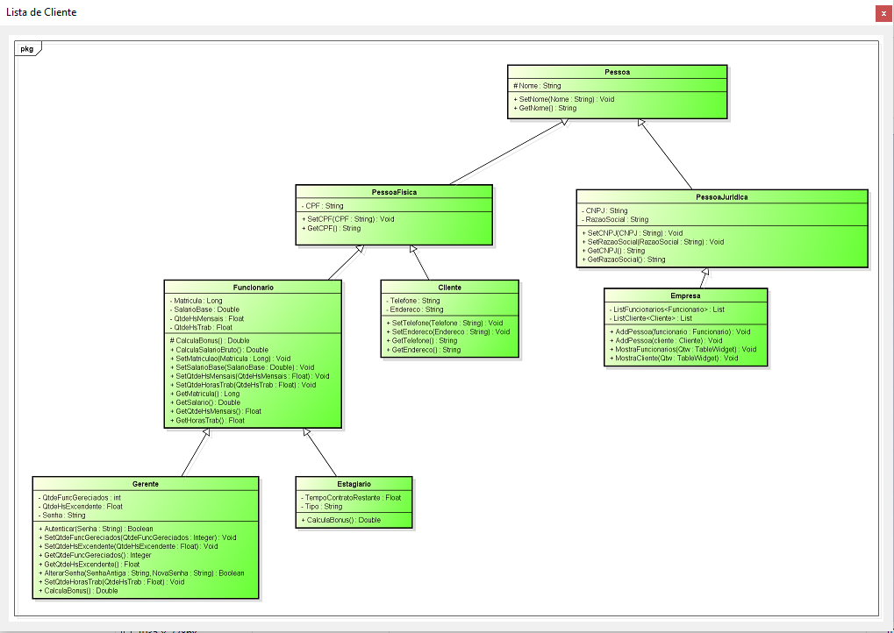

# ERP System

ERP system for registration of employees, customers and payroll. The system has extras functions to developers. 
This was the first ERP system I developed (2013) using C ++ and MySQL database.

  

  

  

  

  

